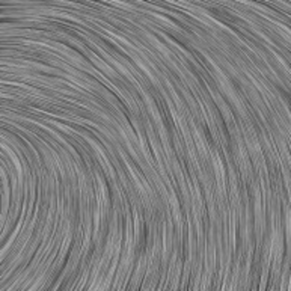
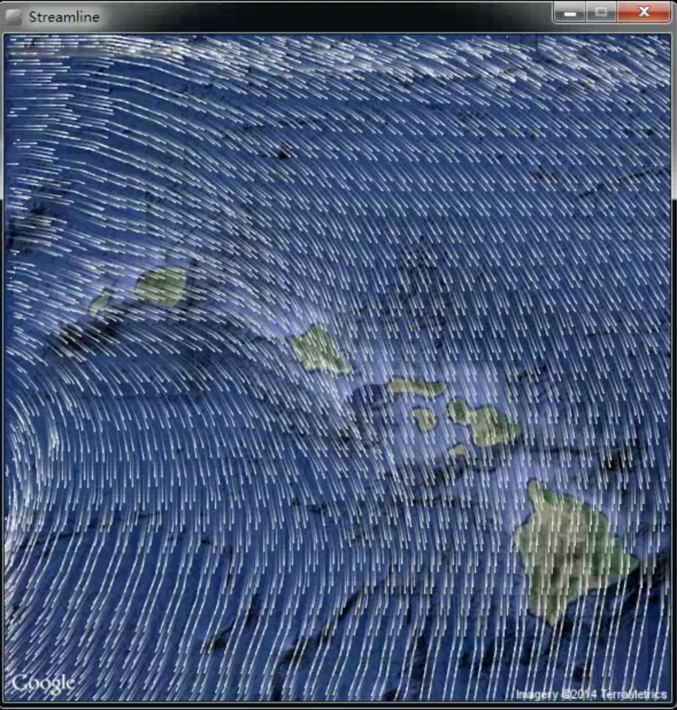
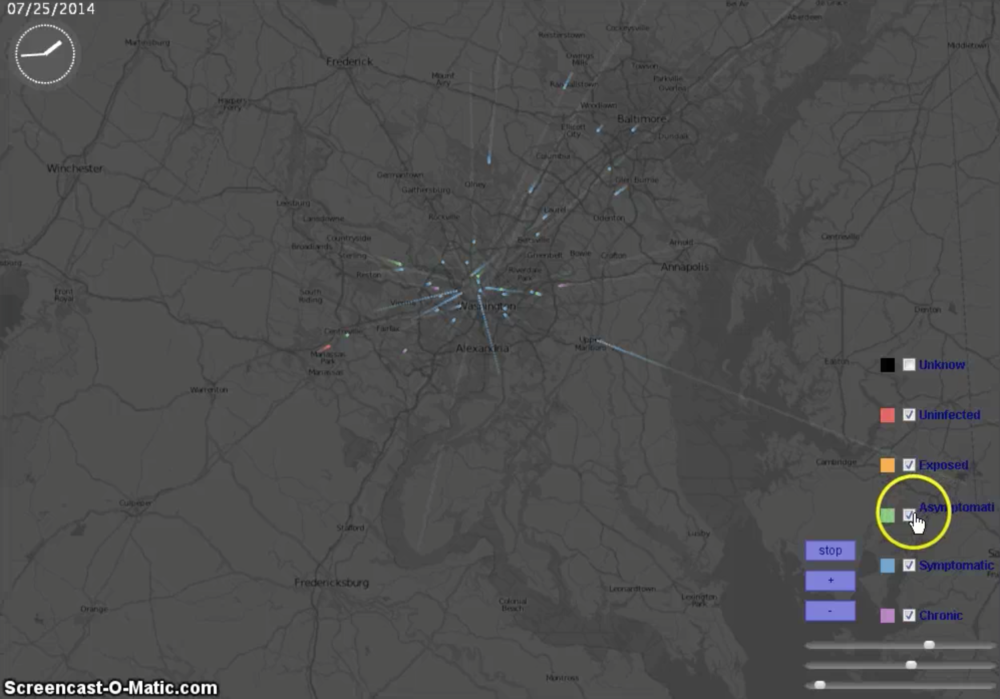

Visualization Project on Processing
==========
Introduction
-------------
This is a visualization projects done by Processing, it consists three parts.

used to visualize the wind in Guam, which use the technique called Line integral convolution.

  - Line Intergral Convolution Algorithm
  - Wind in Hawaii
  - Disease Situation in Washington, DC.

They are in the Project folder, three projects seperately. If you want to know more, in the Presentation folder, it is my presentation for the whole project, while in Presentation/result folder, you could see three mp4 videos, which are summary result of this project.

1.Line Intergral Convolution Algorithm
----------------

2.Wind in Hawaii
----------------

3.Disease Situation in Washington, DC.
-----------------

